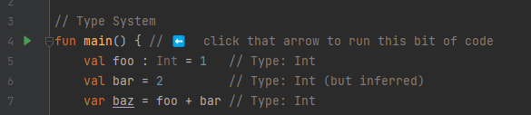

# Welcome!

### I hope you're having an amazing day! 🚀

This repository is a reference of how I think one should approach learning kotlin step-by-step.
Inside the source code, you'll find a bunch of packages ordered from zero and up.

Each package might contain various `.kt` files, but it will contain a `Main.kt` file,
that aggregates something from inside that package to teach about a specific
Kotlin subject.

Please feel free to give feedback towards how I could make this repository a better learning experience.

By the way, I build this to be used as a guide on dev sprints I lead at [DevPass](https://devpass.com.br/)

### How to run the code

The idea is to be as simple as possible, just hit the green arrow, and see what the code does.

**Also, don't forget to debug the code for a better understanding 😉**
